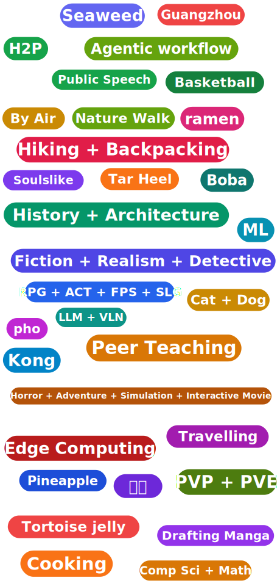

  

<table>
  <tr>
    <td valign="top" width="46%">
      
    </td>
    <td valign="top" width="54%" align="center">
      
       
      <i>✨  <strong>FOLLOW THE HEART</strong>  ✨</i>
        
      
        
      
       
      <i>✨🌪️ <strong> FOLLOW THE WIND </strong> 🌪️✨</i>
    </td>
  </tr>
</table>

<picture>
  <source media="(prefers-color-scheme: dark)" srcset="https://raw.githubusercontent.com/KraLurmumcoelcarix-173/KraLurmumcoelcarix-173/output/github-contribution-grid-snake-dark.svg" />
  
</picture>

